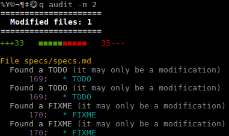

Gut specification
=================

Make sure you read the section __Getting started__ before the rest so you are aware of how the flow is supposed to work.

<!-- TOC: BEGIN -->
* [Getting started](#getting-started)
  * [Installation](#installation)
    * [Basic features installation](#basic-features-installation)
    * [Shell features installation](#shell-features-installation)
  * [Initialization](#initialization)
    * [Gut configuration file](#gut-configuration-file)
    * [Repository configuration file](#repository-configuration-file)
  * [Spirit of the git flow](#spirit-of-the-git-flow)
    * [Organization of your repositories](#organization-of-your-repositories)
    * [Git branching](#git-branching)
      * [Branch flow](#branch-flow)
      * [Branch naming](#branch-naming)
      * [Commit messages format](#commit-messages-format)
* [Git features](#git-features)
  * [Audit](#audit)
  * [Burgeon](#burgeon)
  * [Divisions](#divisions)
  * [Execute](#execute)
  * [History](#history)
  * [Obliterate](#obliterate)
  * [Pile](#pile)
  * [Pushb popb](#pushb-popb)
  * [Replicate](#replicate)
  * [Switch](#switch)
  * [Thrust](#thrust)
  * [Undo](#undo)
* [Shell features](#shell-features)
  * [Jump](#jump)
* [Advanced features](#advanced-features)
  * [CI](#ci)
    * [Gut CI configuration example:](#gut-ci-configuration-example)
  * [PR](#pr)
    * [Gut PR configuration example](#gut-pr-configuration-example)
* [Miscellaneous features](#miscellaneous-features)
  * [Copy branch](#copy-branch)

<!-- TOC: END -->

## Getting started

### Installation

#### Basic features installation

~~Just run `npm i -g gut-flow`. You're all set!~~

This package hasn't been released to npmjs.org because it's not stable enough at the moment. It'll be released soon but in the meantime, you can try it out by cloning the repository and running `npm link` at the top-level.

#### Shell features installation

Some features gut provides change the terminal's directory or maintain variables that should have the same life span
as the terminal.

It was not possible to implement those in pure NodeJS so some features are implemented in bash. You can find the list
of available shell scripts in the folder [shell](https://github.com/quilicicf/Gut/tree/master/shell).

To use these features, run `gut install` and paste the following code to your `.bashrc`:

```shell
# Installation of Gut scripts, see https://github.com/quilicicf/Gut/blob/master/specs/user_documentation.md#shell-features
# If the link is broken, you probably want to read the README again https://github.com/quilicicf/Gut/blob/master/README.md
installGutScripts() {
  local script
  test -d ~/.config/gut && {
    while read script; do
      . "$script"
    done <<< "$(find ~/.config/gut -name '*.sh')"
  }
}
installGutScripts
```

### Initialization

#### Gut configuration file

Gut keeps a configuration file in `~/.config/gut/config.json`.
You'll be guided to build this file when you run any gut command if it does not exist.
To change the configuration, run `gut configure`, it is recommended not to update the file by hand.

Contents of the file:

```json
{
  "accounts": {
    "github": {
      "username": "your GitHub username",
      "pullRequestToken": "your OAuth 2.0 token for creating pull requests"
    }
  },
  "repositoriesPath": "The path to your folder containing git repositories. Yes it's assumed all are in one place!",
  "preferredGitServer": "The git server you are using, only github supported ATM"
}
```

For `preferredGitServer` the only git server supported at the time is `github`. Other servers will potentially be
added - as well as the possibility to configure yours - in the future.

#### Repository configuration file

Gut will search for a file named `.gut-config.json` at the root of your repositories to retrieve the repository-specific configuration. This file is supposed to be committed and shared among developers. It should never contain something you don't want to be online.

Contents of the file:

```json
{
  "ci": {
    "<CI tool name>": {
      "<job name>": {
        "server": "the tool's server name",
        "uri": "the job's URI, relative to the selected server's URI",
        "body": "the body that should be POSTed to the job's URI"
      }
    }
  },
  "commitMessageSuffixTemplate": "Template of the suffix that should be added to your commit messages",
  "reviewTool": "Name of the review tool (only github supported ATM)"
}
```

Example of configuration:

```json
{
  "ci": {
    "jenkins": {
       "build": {
         "server": "personal",
         "uri": "/jobs/gut",
         "body": {
           "branch_or_tag": "$currentBranch"
         }
       }
    }
  },
  "commitMessageSuffixTemplate": "#$ticketNumber",
  "reviewTool": "github"
}
```

* `ci`: contains the jobs configuration of your CI tools
  * `<CI tool name>`: the name of the CI tool. Only `jenkins` is supported ATM.
    * `<job name>`: configure your repository's jobs here.
      * `server`: the name of the server to use. The server configuration will be retrieved by this name in your global configuration. This allows you to share your repository configurations without putting the URLs to your CI tool on the internet.
      * `uri`: the job's URI, relative to the URI of your server.
      * `body`: the JSON body that will be POSTed to the job's URI. See [the ci command](#ci) for more information.
* `commitMessageSuffixTemplate`: when committing on a branch that contains a ticket number, gut will look for the
suffix template. If a suffix is found, the template will be used to suffix the commit message, replacing
`$ticketNumber` with the actual ticket number, retrieved from the branch name (see [branch naming](#branch-naming)).
* `reviewTool`: the review tool to be used for this repository. Only `github` is supported ATM.

### Spirit of the git flow

#### Organization of your repositories

It is assumed you'll keep all your repositories into a single folder, which will be named __forge__ in the rest of
this document and is structured like the following.

```
forge
├── github
│   ├── owner1
│   │   ├── repo1
│   │   └── repo2
│   └── owner2
│       ├── repo1
│       └── repo2
└── gitlab
    ├── owner1
    │   ├── repo1
    │   └── repo2
    └── owner2
        ├── repo1
        └── repo2

```

#### Git branching

##### Branch flow

Branch types:
- __Master:__ The branch `master` is a branch that strictly follows the production. It is therefore a faithful
representation of what's in production at ANY MOMENT
- __Version branches:__ When starting the development of a version, a branch is created from master.
- __Feature branches:__ A version can contain multiple features. In case two or more developers work on a feature, they
can create a branch from the version branch. To allow for scope adjustment, the feature can be merged in the next
version if need be.
- __Dev branches:__ When working on a ticket, a dev creates a branch from the feature or version branch.

The following rules apply to the branches:
1. It is allowed to force-push on branches that are only used by a single developer (to create a clean history).
2. As soon as two developers start working on the same branch, force-push is prohibited (I'll implement safe-guards but
that's a little further down the roadmap).
3. To have a clean history, the rebase is preferred to update the version/feature/dev branches to the last modifications.
They should be done when there's the fewest branches open and the branch that's to be rebased must be duplicated
first of course (there'll be tooling down the roadmap for that too).
4. The rebase-and-merge feature is to be preferred when merging branches down.
5. Delivery to the QA team is done y creating a tag named as a time stamp (ISO 8601)
6. When the QA validates a tag, it is merged into master, then production tag is created and named `v<full version>`
7. Build
    1. All version branches and master should be built every time their source code changes
    2. Feature branches can specify they should be built by adding `build` before the `#`
    3. Dev branches should be built when the PR is done or on-demand (a feature is coming to make the on-demand part a
    4. command away

Benefits of this flow:
- there is a branch that follows the production so it's easy to know what's in prod and debug it
- the history is linear and really easy to read
- forgetting to merge something seldom happens
- even if the rebase was not done on alive branches after a merge to master, there should never be devs lost in
translation

Attention points:
- the tag that goes to production is not exactly the tag validated by the QA. If the merge is not smooth, the QA
might need to re-check things
- when a tag is merged into production, all live branches must be rebased

##### Branch naming

- Version branches: `<major version>.<minor version>.<patch version>` ex: `2.3.19`
- Feature branches: `<full version>_#<feature>` ex: `2.3.19_#whatsNewDialog`
- Dev branches: `<full version>_#<feature>_<ticket number>_<dev>` ex: `2.3.19_#whatsNewDialog_8495_optOut` or if
there's no feature branch `2.3.19_456_noLogsBug`

Benefits of this naming:
- No need to look at the commit tree to find where a dev started
- Easy to spot if a branch is not rebased to the right origin (merging `1.2.2_123_totoFeature` in `1.3.0` should
raise an alarm in your head)
- Easy to clean the old local branches, just filter them with regex (there's gonna be a utility for that)
- Easy to interact with CI/CD, the branch is parsable, the ticket number easy to retrieve

##### Commit messages format

Commit messages should be suffixed with the ticket number so that your bug tracker/CI/CD can track them and associate
 the commit to the ticket.

In GitHub, you can suffix your commit message with `#<ticket number>` and GitHub will reference the commit in the
 issue.

In JIRA, you can suffix the commit message with `(<project id>-<ticket number>)` to get the same result.

## Git features

The features in this section are mostly syntactic sugar over existing git features. You might wonder why their names are poor homonyms of the git features they replace. It's simply because git and gut are really close to one another and easily mistyped. The changed names make it clearer what you are using.

### Audit

Usage: `gut audit`.

Inspects a git diff and displays a summary. Displayed items are:
* Lines added/removed
* Oddities found in the added code
  * TODO
  * FIXME
  * Abusive printing (console.log in JS, System.out.print in Java)
  * Local paths (looks for your home directory)

Arguments:
* `-n` inspect the n last commits (exclusive with -f and -t)
* `-f` the commit from which to start the diff
* `-t` the commit where the diff ends

Example output:



### Burgeon

Usage: `gut burgeon -v 2.10.0`

Creates a new branch and checks it out.

Arguments:
- `-v` create a new version branch, the value of the parameter is the version (follows semver). You can only create a
version branch from master or another version branch.
- `-f` create a new feature branch, the value of the parameter is the feature's description. It can't contain an
underscore. You can only create a feature branch from master or a version branch.
- `-i` only usable with `-f`. If set, the feature branch will be built each time your commit on the branch.
- `-d` create a new dev branch, the value of the parameter is the dev's description. It can't contain an underscore.
You can create dev branches from every type of branches but dev branches.
- `-n` only usable with `-d`. The ticket number associated with the dev.

Examples:
- `gut burgeon -v 2.35.9` (called from `master`) creates a version branch named `2.35.9`
- `gut burgeon -f myFeature -i` (called from `2.35.9`) creates a feature branch named `2.35.9_build#myFeature`
- `gut burgeon -d myDev -n 123` (called from `2.35.9_build#myFeature`) creates a dev branch named
`2.35.9_build#myFeature_123_myDev`

### Divisions

Usage: `gut divisions -r o`.

Displays the branches on a specific remote. The parameter r is the name of the remote or all to show all branches.
There are a few shortcuts to go faster:
- a stands for all
- l stands for local
- o stands for origin
- u stands for upstream

If the parameter is omitted, only the local branches are shown.

### Execute

Usage: `gut execute -m <message>`.

Creates a commit with the provided message.

Arguments:
* `-m`: The commit message. It will be automatically suffixed with the ticket number if available (in the branch name)
and the repository is configured (see [Repository configuration file](#repository-configuration-file))
with `commitMessageSuffixTemplate`. The commit message is an array, you don't need to quote it (see examples).
* `-c`: Creates a code review commit, the message is set to `:eyes: Code review`, suffixed with the ticket number if
applicable. Mutually exclusive with `-m`

Examples:
* `gut execute -m :memo: Specify better commit messages` will create a commit with a message set to
`:memo: Specify better commit messages`. Note: you will need to quote it if you have a word that begin with `-` in the
commit message, otherwise it will be seen as a parameter to the gut command.
* `gut execute -m ':memo: Specify better commit messages'` will create a commit with a message set to
`:memo: Specify better commit messages`.
* `gut execute -c`will create a commit with a message set to `:eyes: Code review`.

The commit should fail if the user has unstaged changes.

### History

Usage: `gut history`.

Displays commits history (equivalent to `git log`).

Arguments:
* `-f` format, the format in the list of predefined formats (see list below, defaults to `pretty`)
* `-s` skip the n first commits in the history (defaults to 0)
* `-n` shows only n commits (default to 100)
* `-r` reverses the order in which the commits are shown. If not specified, the commits will be displayed from newest
 to oldest.
* `-b` show commits that were added from base branch

Available formats:
* `pretty`: a colored and well indented format, see screenshot below
* `json`: the commits are returned as a JSON array
* `sha`:  only the shas are returned. Very useful when used with reverse to cherry-pick a few commits!

Log format `pretty`:


### Obliterate

Usage: `gut obliterate -b master_deleteSpec -r o`

Deletes an item on the specified remote. Can delete branches and tags.

Arguments:
  * `-r` The remote where the item should be deleted, defaults to `local`. Can be:
    * local: if not defined or in `['l', 'local']`)
    * origin: if in `['o', 'origin']`
    * upstream: if in `['u', 'upstream']`
  * `-b` The name of the branch to delete. Exclusive with `-t`
  * `-t` The name of the tag to delete. Exclusive with `-b`

Examples:
  * `gut obliterate -b master_deleteSpec`: deletes the branch `master_deleteSpec` locally.
  Literally does `git branch -D master_deleteSpec`
  * `gut obliterate -t v1.2.3 -r o` deletes the tag `v1.2.3` on `origin`.
  Literally does `git push --delete origin v1.2.3`

### Pile

Usage: `gut pile`.

Adds all the changes in the repository. Literally does `git add <repository top level> -A`.

### Pushb popb

Usage: `pushb <branch name>; do things; popb`

Works like pushd and popd but for GitHub branches.

> Note: This feature is implemented in bash, it requires some specific [installation steps](#shell-features).

### Replicate

Usage: `gut replicate -s server -o owner -r repo`.

Clones the repository in `<forge>/<server>/<owner>/<repo>`.

If you omit the server, the `preferredGitServer` from your [configuration file](#gut-configuration-file) will be used.
If you omit the owner, the `username` from your [configuration file](#gut-configuration-file) will be used.

### Switch

Usage: `gut switch -t <target branch>`.

Checks out a branch.

Arguments:
* `-t` target branch, if it exists
* `-r` regex to be used to search for the branch to check out
* `-n` search the branch by ticket number
* `-m` switch to master
* `-v` switch to the version branch
* `-f` switch to the feature branch
* `-b` switch to the base branch
* `-l` switch to the last visited branch (run `git checkout -`)

Examples:
* `gut switch` triggers an interactive branch switch. Gut will display the available branches and let you choose your target
* `gut switch -t master` switches to branch `master`
* `gut switch -r myDev` would match branch `9.1.6_2345_myDev` and check it out if it were the only match
* `gut switch -n 2345` would match branch `9.1.6_2345_myDev` and check it out if it were the only match
* `gut switch -m` would switch to `master`
* `gut switch -v` on branch `2.11.0_#myFeature` would switch to `2.11.0`
* `gut switch -f` on branch `2.11.0_#myFeature_123_myDev` would switch to `2.11.0_#myFeature`
* `gut switch -b` on branch `2.11.0_#myFeature` would switch to `2.11.0`
* `gut switch -b` on branch `2.11.0_#myFeature_123_myDev` would switch to `2.11.0_#myFeature`

### Thrust

Usage: `gut thrust`.

Pushes changes to the remote and sets the branches upstream to `<remote>/<branchName>`.
The user can always change the remote to push to but he must do it the first time he pushes a branch if there's more
than one remote configured.

Arguments:
* `-r` remote, the remote to push to

### Undo

Usage: `gut undo -n 2`.

Undoes the last n commits.

Arguments:
* `-n` commits number, the number or commits to undo
* `-s` stash, stashes the changes
* `-d` description, use with `stash`, stashes the changes with the given description as stash item name
* `-h` hard, erases the changes, a confirmation is shown to prevent unwanted data loss

## Shell features

### Jump

Usage: `jump gut`.

Changes the shell's directory to a repository that matches the search.

Arguments:
* `-g` git server, ex: github, bitbucket... By default, all of them match
* `-o` the repository owner. By default, all of them match
* `-r` the repository name. By default, all of them match
* `positional argument 1` if there is only one argument, it'll be used as the repository name

Each element is a glob, defaulting to `**`. The search it based on the assumption that your repositories are all in a single folder as described in chapter [organization of your repositories](#organization-of-your-repositories).

To simplify the typing, the repository name search you provide will be surrounded with `*`. This means that `jump tube` will actually run `find "$repositoriesFolder" -maxdepth 3 -ipath '**/**/*tube*' | sort`.

> Note: the search is case-insensitive.

## Advanced features

The features in this section are the most powerful in gut. They allow you to configure your git flow precisely and to integrate with the tools you are using in your everyday life.

### CI

Usage: `gut ci`

Allows you to run CI jobs on your repository from the command line.

Configure the jobs for your repository in the [repository configuration file](#repository-configuration-file). Make sure to add the CI server/account in your [Gut configuration file](#gut-configuration-file).

When you run the command, it will either run the job if it's alone or display the list of existing jobs and ask you which one should be run.

#### Gut CI configuration example:

Global configuration file (personal file):

```json
{
  "accounts": {
    "jenkins": {
      "username": "quilicicf",
      "password": "tititatatoto"
    }
  },
  "tools": {
    "jenkins": {
      "servers": {
        "personal": "https://jenkins.quilicicf.fr",
        "company": "https://jenkins.mycompany.com"
      }
    }
  }
}
```

Repository configuration file (shared via git):

```json
{
  "ci": {
    "jenkins": {
       "build": {
         "server": "personal",
         "uri": "/jobs/gut/build",
         "body": {
           "branch_or_tag": "$currentBranch"
         }
       }
    }
  }
}
```

### PR

Usage: `gut pr`

Creates a pull-request on the tool of your choice (only GitHub implemented as of today).
An audit of the commits added from the base branch is performed before anything else.

Arguments:
* `-o` opens the PR URL in the system's default browser
* `-c` copies the PR URL to the system's clipboard

The review tool must be configured in the [repository configuration file](#repository-configuration-file).
A valid OAuth 2.0 token must be set in the [Gut configuration file](#gut-configuration-file).
You can create the token [here](https://github.com/settings/tokens), please note these tokens should not be used for
multiple usages.

#### Gut PR configuration example

Global configuration file (personal file):

```json
{
  "accounts": {
    "github": {
      "username": "quilicicf",
      "pullRequestToken": "tititatatoto"
    }
  }
}
```

Repository configuration file (shared via git):

```json
{
  "reviewTool": "github"
}
```

## Miscellaneous features

All the features that don't belong to other categories but are still quite handy!

### Copy branch

Usage: `gut copy-branch`

Copies the current branch to the clipboard.

It uses the node package [copy-paste](https://www.npmjs.com/package/copy-paste) to interact with your system's clipboard. If it does not work on your system, and you get copy-paste to support it, create an issue and the version will get bumped.
